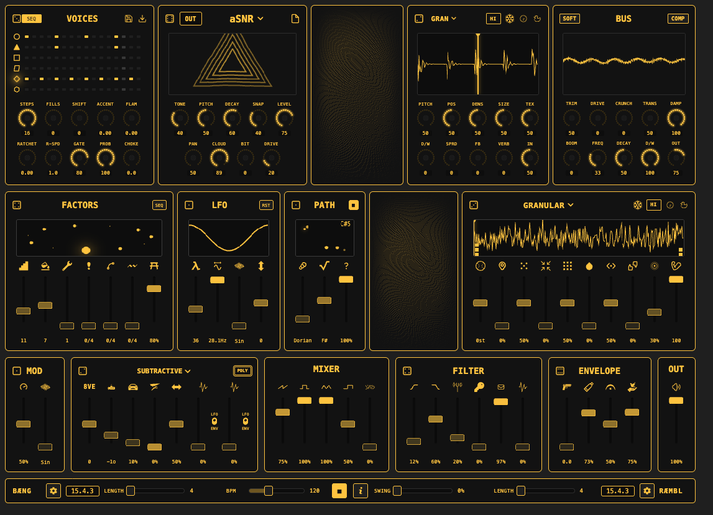

# Bæng & Ræmbl

**Unified Web Audio Synthesiser Suite**

A powerful web-based synthesiser combining a 6-voice drum machine (Bæng) with a polyphonic synthesiser (Ræmbl), synchronised timing, and professional effects processing.

---

**[Live Demo](https://midislave.github.io/baeng-and-raembl/)** • **[Documentation](docs/index.md)** • **[GitHub](https://github.com/MidiSlave/baeng-and-raembl)**

---

## Quick Start

1. **Click the Play button** to start the shared clock
2. **Click Bæng step buttons** to trigger drum patterns
3. **Adjust Ræmbl parameters** to shape melodic voices

Both synthesisers run in perfect sync with independent audio routing.

## Features

### Bæng (Drum Machine)

| Feature | Description |
|---------|-------------|
| **Voices** | 6 independent drum voices (T1-T6) |
| **Engines** | DX7 FM, Analog, SMPL (Sample), SLICE (Sample Slicer) |
| **Sequencer** | Per-voice step sequencer with Euclidean patterns, probability, ratchets, accents |
| **Master FX** | Drum Bus processor (Drive, Crunch, Transients, Boom, Compression, Dampen) |
| **Modulation** | PPMod system with 6 modes (LFO, RND, ENV, EF, TM, SEQ) - per-voice or global |

### Ræmbl (Synthesiser)

| Feature | Description |
|---------|-------------|
| **Voices** | 8-voice polyphonic (mono/poly modes) |
| **Engines** | Subtractive (SUB), Plaits (24 engines), Rings (6 resonator models + Easter Egg) |
| **Sequencer** | Euclidean pattern generator + pitch path sequencer with slide, accent, trill |
| **Filter** | TPT lowpass/highpass with resonance and envelope modulation |
| **Modulation** | PPMod system with 6 modes - per-voice polyphonic modulation in poly mode |

### Shared Features

- **Synchronised Clock** - Unified BPM, swing, and bar length controls
- **Clouds FX Engine** - 6 modes (Granular, WSOLA, Looping Delay, Spectral, Oliverb, Resonestor)
- **Reverb & Delay** - Independent routing for each app with global sends
- **Sidechain Ducking** - Bæng can duck Ræmbl output for mix clarity
- **Unified Patch Format** - Save/load complete sessions (v1.2.0)
- **Per-Parameter Modulation** - 6-mode PPMod system (LFO, Random, Envelope, Envelope Follower, Turing Machine, Sequencer)

## Documentation

- **[Getting Started](docs/user-guide/getting-started.md)** - Installation and first sounds
- **[Bæng Guide](docs/user-guide/baeng-guide.md)** - Drum machine reference
- **[Ræmbl Guide](docs/user-guide/raembl-guide.md)** - Synthesiser reference
- **[Effects](docs/effects/)** - Clouds, Reverb, Delay, Drum Bus, Sidechain
- **[Modulation](docs/modulation/)** - PPMod system (6 modes)
- **[Developer Docs](docs/developer/)** - Architecture and code patterns

## Browser Requirements

| Browser | Minimum Version | Notes |
|---------|----------------|-------|
| **Chrome** | 90+ | Recommended for best performance |
| **Firefox** | 88+ | Full AudioWorklet support required |
| **Safari** | 14+ | HTTPS required for AudioWorklet |
| **Edge** | 90+ | Chromium-based versions only |

**HTTPS Required** - AudioWorklet API requires secure context (HTTPS or localhost).

**Not Supported** - Internet Explorer, legacy Edge (pre-Chromium).

## Technical Highlights

- **Web Audio API** - All synthesis and effects run in the browser
- **AudioWorklet Processors** - Low-latency audio thread synthesis (Ræmbl voices, Clouds FX, Drum Bus)
- **Pre-Allocated Voice Pool** - 8 fixed voices eliminate polyphony dropouts
- **100ms Lookahead Scheduler** - Audio-thread precision timing
- **Separate Audio Routing** - Independent effects chains with -3dB headroom per app

---

Built with Web Audio API • No installation required • Works offline after first load
